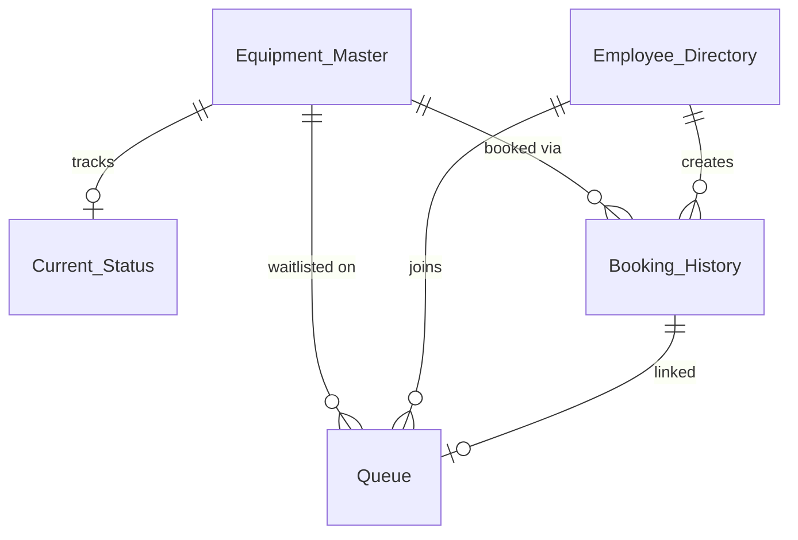

# 📋 REMS — Client Walkthrough & Analysis Report

**Research Equipment Management System**
**Version:** 1.0 — Production Ready
**Date:** July 2026

---

## 1. Executive Summary

**REMS** (Research Equipment Management System) is a cloud-based, mobile-first web application designed to eliminate equipment hoarding, reduce idle time, and bring complete transparency to R&D laboratory operations.

### The Problem It Solves

In research and development facilities, shared laboratory equipment — oscilloscopes, spectrometers, 3D printers, testing chambers — is a scarce, high-value resource. Without a management system:

- Researchers **waste time** walking to machines only to find them occupied
- Equipment gets **hoarded** — users book it but don't release it when done
- There's **no visibility** into who is using what, and for how long
- Lab managers have **no data** on equipment utilization for planning or procurement
- **Conflicts arise** between teams over access priority

### The REMS Solution

REMS provides a **single source of truth** for every piece of equipment in your facility. A researcher can either **scan a QR code** on the machine or **open a central dashboard** from anywhere, and instantly:

- See if the machine is available, who is using it, and when it will be free
- Book it with a single tap
- Join a digital waitlist if it's busy
- Extend their session or release early
- View their complete usage history

The system is **fully autonomous** — a background automation engine runs every minute to detect expired bookings, release equipment, and promote the next person in the queue. **Zero manual administration required.**

---

## 2. Platform Overview

| Attribute | Detail |
|-----------|--------|
| **Type** | Progressive Web Application (works on any device with a browser) |
| **Access** | Via URL — no app store download required |
| **Backend** | Google Apps Script (serverless, auto-scaling) |
| **Database** | Google Sheets (7 structured tables, directly viewable by management) |
| **Hosting Cost** | **₹0 / $0** — runs entirely on Google Workspace infrastructure |
| **Authentication** | Employee ID-based (validated against a managed directory) |
| **Notifications** | Automated email alerts when a user is promoted from the waitlist |
| **Backup** | Automated daily backups to Google Drive |

---

## 3. Complete Feature Walkthrough

### 3.1 🏠 The Home Dashboard — Equipment Catalog

The Home Dashboard is the **central command center** of the facility. Accessible from any device — desktop, tablet, or mobile.

#### What the user sees:
- A **sleek dark-mode interface** with animated gradient backgrounds
- Every piece of equipment in the facility displayed as a **card** showing:
  - Equipment name and ID
  - Physical location (e.g., "Lab-B, Bench 4")
  - Category (e.g., "Measurement", "Fabrication", "Testing")
  - **Real-time status badge:**
    - 🟢 **Available** — ready to use
    - 🔴 **In Use** — currently occupied
    - 🟡 **Maintenance** — temporarily offline
  - A scannable mini QR code

#### Key capabilities:
| Feature | Description |
|---------|-------------|
| **Instant Search** | Type any keyword — the grid filters in real-time by equipment name or ID |
| **One-Tap Navigation** | Click any card → opens the detailed booking page for that equipment |
| **Built-in QR Scanner** | A floating "Scan QR" button opens the phone camera directly within the app — no separate scanner app needed |
| **Responsive Layout** | Cards auto-arrange from 1 column (mobile) to 4 columns (desktop) |

---

### 3.2 📱 Equipment Status & Booking — The Core Workflow

When a user scans a QR code or taps an equipment card, they land on the **Equipment Status Page** — a sophisticated Single Page Application with 5 intelligent screens.

#### Screen 1: Equipment Status (Landing)

The user sees:
- **Equipment identity card** — Name, Category, Location displayed in profile chips
- **Large status badge** — real-time availability with animated pulse dot
- **Waitlist counter** — if people are queuing, shows "3 people are waiting"
- **Check-In form** — enter Employee ID and tap "Check In"

> **Smart Remember:** After the first check-in, the system stores the Employee ID in the browser. On all future visits, the ID is **pre-filled automatically** — one less step, zero friction.

#### Screen 2: Book Equipment (When Available)

If the equipment is free:
- User sees a warm welcome: *"Welcome back, Alice"* with their name and department
- **Duration picker** with pill-shaped buttons: 30 min, 1 hour, 2 hours, 3 hours, 4 hours, 5 hours, 1 day, 2 days
- One tap on **"Confirm Booking"** → equipment is instantly reserved
- The entire facility's dashboard updates immediately

#### Screen 3: Join Waitlist (When Busy)

If the equipment is occupied:
- User sees **who** is currently using it (name and Employee ID) — full transparency
- A warning banner with a message: *"Currently in use by Bob (ID: EMP-042)"*
- The booking form transforms into **"Join Waitlist"**
- Selecting a duration and tapping "Join Queue" places them in a digital line
- When the current user finishes, the system **automatically** promotes the next person and sends them an **email notification**: *"Equipment is now free and reserved for you. Please proceed to the lab."*

#### Screen 4: Manage Active Session (When You're the User)

If the user who checks in is currently using this equipment:
- They see a **management dashboard** instead of a booking form
- A large **Expected Free Time** display (e.g., "02:30 PM")
- **"Free Equipment Now"** button — releases immediately, triggers queue promotion
- **"Request Extension"** dropdown — select 30 min / 1 hour / 2 hours → extends their session

#### Screen 5: Queue Position (When Waiting)

If the user is already in the waitlist:
- They see their **exact queue position** in a large, prominent display (e.g., Position #2)
- **"Withdraw from Queue"** button — removes them from the waitlist instantly
- Queue positions auto-recalculate for everyone behind them

---

### 3.3 👤 User Profile — Personal Dashboard

Accessible from the profile icon in the header, this page gives each user complete visibility into their own activity.

#### Features:
| Feature | Description |
|---------|-------------|
| **Identity Badge** | User's name, department, and Employee ID prominently displayed |
| **Active Bookings Tab** | All equipment they're currently using or waiting for — each card links directly to that machine's status page for one-tap management |
| **History Tab** | Complete audit trail of every machine they've ever used — date, time range, duration |
| **Sign Out** | Clears session data and redirects to the Home Dashboard |

> **Self-Healing Data:** The profile page includes intelligent data correction — if a booking record is marked "Using" but the equipment has already been freed (e.g., by the automation engine), the system auto-corrects it to "Completed" in the display. Users never see stale or contradictory data.

---

### 3.4 🔲 QR Code System — Physical-Digital Bridge

Each piece of equipment gets a **unique QR code** that, when scanned, opens the booking page for that specific machine.

#### How QR codes are generated:
1. Lab admin adds new equipment to the `Equipment_Master` sheet
2. Clicks **REMS Menu → Generate QR Codes** from the spreadsheet toolbar
3. System creates a professionally formatted **"Master QR Labels"** spreadsheet with:
   - Serial number
   - Equipment ID
   - Equipment Name
   - Scannable QR code image (ready to print)
4. QR codes also appear inline on the master sheet for reference

#### QR Code Workflow:
```
Physical QR Sticker on Machine
        ↓ (Phone Camera Scan)
REMS Status Page (pre-loaded with that machine's data)
        ↓ (Enter Employee ID)
Book / Queue / Manage / Withdraw
```

The QR codes encode the full web app URL with the equipment ID as a parameter, making them work with **any phone's native camera** — no special app required.

---

## 4. Automation Engine

REMS includes a **fully autonomous background engine** that requires zero manual intervention.

### 4.1 Auto-Expiry & Queue Promotion

A time-driven trigger runs **every 60 seconds** and performs:

| Step | Action |
|------|--------|
| 1 | Scans all equipment currently marked as "Using" |
| 2 | Compares booking end time with the current time |
| 3 | If expired → marks booking as **"Completed"** |
| 4 | Checks the waitlist for that equipment |
| 5 | If queue exists → **auto-promotes** the first person to active user |
| 6 | Sends an **email notification** to the promoted user |
| 7 | Recalculates queue positions for everyone remaining |
| 8 | If no queue → marks equipment as **"Available"** |
| 9 | Logs everything in the Audit trail |

> **Result:** Even if a researcher forgets to release a machine, the system handles it automatically. No equipment stays "stuck" in a perpetually busy state.

### 4.2 Auto-Sync (Equipment Registration)

When a lab admin adds a new row to the `Equipment_Master` sheet:
- The system automatically detects the new entry
- Creates a corresponding "Available" entry in the `Current_Status` tracking sheet
- No manual setup required — add a row, and the equipment is live

### 4.3 Automated Backup

A scheduled backup function creates a **timestamped copy** of the entire database spreadsheet and stores it in a dedicated Google Drive folder. This protects against:
- Accidental data deletion
- Spreadsheet corruption
- Unintended manual edits

---

## 5. Administrative Tools

Lab managers and admins have access to powerful tools directly from the Google Sheets interface:

| Tool | Access | Function |
|------|--------|----------|
| **Setup Database** | REMS Menu → Setup Database | One-click creation of all required sheets with correct headers |
| **Generate QR Codes** | REMS Menu → Generate QR Codes | Auto-generates printable QR labels for all equipment |
| **Run Manual Backup** | REMS Menu → Run Manual Backup | Creates an on-demand database snapshot |
| **Direct Data Access** | Open the spreadsheet | View, filter, sort, and analyze all bookings, users, and logs using familiar spreadsheet tools |
| **Custom Reports** | Google Sheets formulas | Build utilization reports, department-wise usage analytics, peak hour analysis — all with standard spreadsheet formulas |

---

## 6. Database Architecture

The database is structured as **7 specialized sheets** within a single Google Spreadsheet, designed for both application use and direct human readability.

### 6.1 Schema Overview



### 6.2 Table Descriptions

| # | Sheet | Role | Key Columns |
|---|-------|------|-------------|
| 1 | **Equipment_Master** | Central registry of all lab assets | Equipment_ID, Name, Category, Location, Max_Duration, QR_URL, Status |
| 2 | **Current_Status** | Real-time state dashboard (powers the live UI) | Equipment_ID, Status, Current_User, Booking_ID, Start/End_Time, Next_User |
| 3 | **Employee_Directory** | Authorized personnel registry | Employee_ID, Name, Department, Email |
| 4 | **Booking_History** | Immutable transaction ledger (18 columns) | Booking_ID, Equipment_ID, Employee_ID, Scheduled vs. Actual times, Status, Extensions |
| 5 | **Queue** | Digital waitlist manager | Queue_ID, Equipment_ID, Employee_ID, Position, Added_On |
| 6 | **Audit_Log** | Security and diagnostics tracker | Timestamp, User, Action, Equipment, Details |
| 7 | **Settings** | Global configuration key-value store | Setting, Value |

### 6.3 Data Integrity Features

| Feature | How It Works |
|---------|-------------|
| **Relational Keys** | Equipment_ID links Equipment_Master ↔ Current_Status ↔ Booking_History ↔ Queue |
| **Timestamp Tracking** | Every record has Created_On and Last_Updated fields |
| **Status Lifecycle** | Bookings flow through: `Waiting → Using → Completed` or `Waiting → Withdrawn` |
| **Actual vs. Estimated** | Both `Booking_Start/End` and `Actual_Start/End` are tracked — enabling utilization analysis |
| **Extension Tracking** | `Extension_Requested` and `Extension_Status` fields provide full audit of time changes |

---

## 7. Security Architecture

REMS implements a **5-layer defense-in-depth** security model:

```
┌─────────────────────────────────────────────────────────────┐
│  Layer 5: HTML Output Escaping (XSS Prevention)             │
│  ┌───────────────────────────────────────────────────────┐  │
│  │  Layer 4: Client-Side Template Injection Prevention   │  │
│  │  ┌─────────────────────────────────────────────────┐  │  │
│  │  │  Layer 3: Client-Side Input Sanitization        │  │  │
│  │  │  ┌───────────────────────────────────────────┐  │  │  │
│  │  │  │  Layer 2: Backend API Input Validation    │  │  │  │
│  │  │  │  ┌─────────────────────────────────────┐  │  │  │  │
│  │  │  │  │  Layer 1: Server URL Sanitization   │  │  │  │  │
│  │  │  │  └─────────────────────────────────────┘  │  │  │  │
│  │  │  └───────────────────────────────────────────┘  │  │  │
│  │  └─────────────────────────────────────────────────┘  │  │
│  └───────────────────────────────────────────────────────┘  │
└─────────────────────────────────────────────────────────────┘
```

### Layer-by-Layer Breakdown

| Layer | What It Does | Where |
|-------|-------------|-------|
| **1. Server URL Sanitization** | All URL parameters (`equipment_id`, `page`, `from`) are stripped of special characters at the server before being passed to HTML templates | `Code.gs → doGet()` |
| **2. Backend API Validation** | Every API function sanitizes IDs (alphanumeric + hyphens/underscores only) and validates durations (positive integer, max 10 days) before touching business logic or the database | `Code.gs → sanitizeId(), sanitizeDuration()` |
| **3. Client Input Sanitization** | Employee ID fields strip all non-safe characters before submission | `javascript.html`, `profile_javascript.html` |
| **4. Template Injection Prevention** | Equipment IDs injected via server-side template tags are re-sanitized client-side as a failsafe | `status.html` |
| **5. XSS Output Escaping** | All dynamically rendered HTML content (names, IDs, locations, dates) passes through `escapeHtml()` which neutralizes `<`, `>`, `&`, `"`, `'` characters | `home_javascript.html`, `profile_javascript.html` |

### Additional Security Measures

| Measure | Detail |
|---------|--------|
| **Employee Directory Validation** | Every action (book, extend, release, queue) verifies the Employee ID against the authorized directory. Unregistered IDs are rejected with: *"Unauthorized: Your Employee ID is not registered."* |
| **Ownership Enforcement** | Only the current user can release or extend their own booking. The system checks `booking.Employee_ID === requestor.Employee_ID` before any mutation. |
| **Comprehensive Audit Trail** | Every action — manual edits, bookings, releases, extensions, queue changes, automated promotions, backups — is logged with timestamp, actor, action type, equipment ID, and human-readable details |
| **Manual Edit Detection** | The `onEdit` trigger captures all direct spreadsheet modifications (including cell coordinates, old value, new value, and editor email) and logs them to the Audit_Log — providing tamper detection |
| **Session Management** | `localStorage`-based sessions can be explicitly cleared via "Sign Out", and invalid/stale Employee IDs trigger automatic session reset |
| **Google Infrastructure Security** | All data is encrypted at rest and in transit via Google's infrastructure. Access to the spreadsheet is controlled via Google Workspace sharing permissions |

---

## 8. User Experience Design

### Design Philosophy

REMS uses a **premium, modern design language** that makes the application feel like a native mobile app rather than a spreadsheet tool:

| Element | Implementation |
|---------|----------------|
| **Visual Style** | Dark-mode glassmorphism with frosted-glass cards and animated gradient blobs |
| **Typography** | Inter (Google Fonts) — clean, modern sans-serif used by major tech companies |
| **Color System** | 65+ CSS design tokens with semantic colors: teal for success, red for danger, amber for warnings |
| **Loading States** | Shimmer skeleton screens (not spinners) during initial load — matches modern app patterns |
| **Transitions** | Smooth fade-and-lift animations between screens (0.3s cubic-bezier easing) |
| **Feedback** | Toast notifications slide up from the bottom with contextual colors and icons |
| **Progress Bar** | An animated indeterminate bar at the top of the header during server calls |
| **Responsive** | 3 breakpoints — mobile-first design with enhanced layouts for tablet and desktop |
| **Accessibility** | ARIA labels on interactive elements, keyboard navigation (Enter to submit), high contrast text |

### Performance Optimizations

| Optimization | Benefit |
|-------------|---------|
| **In-Memory Caching** | Backend caches parsed spreadsheet data per execution — prevents redundant API calls |
| **Parallel Fetch Pattern** | After any action, the UI shows a success toast while simultaneously fetching updated data in the background — eliminates the "loading → success → loading again" pattern |
| **30-Second Safety Timeout** | If the Google Apps Script backend hangs (quota limits, cold starts), the overlay auto-dismisses with a friendly error instead of leaving users stuck |
| **Formula Preservation** | The data layer detects and preserves spreadsheet formulas (like QR code `=IMAGE()` formulas) during row updates, preventing data corruption |
| **Cache Invalidation** | After destructive operations (`deleteRow`), the cache is explicitly cleared to prevent stale reads |

---

## 9. Cost Analysis

### Infrastructure Costs

| Component | Cost |
|-----------|------|
| Google Apps Script hosting | **Free** (included in Google Workspace) |
| Google Sheets database | **Free** (included in Google Workspace) |
| Google Drive storage (backups) | **Free** (within Workspace quota) |
| QR code generation (QuickChart API) | **Free** (open API, no key required) |
| Custom domain / SSL | **Not needed** (Google-hosted URL) |
| Server maintenance | **None** (fully serverless) |
| **Total Monthly Cost** | **₹0 / $0** |

### Comparison with Commercial Alternatives

| Feature | REMS | Commercial CMMS (e.g., UpKeep, Fiix) | Custom-Built Solution |
|---------|------|--------------------------------------|----------------------|
| Monthly Cost | **₹0** | ₹10,000–50,000/month | ₹50,000+ development |
| Setup Time | **Minutes** | Weeks | Months |
| QR Code Booking | ✅ | Varies | Custom work |
| Waitlist/Queue | ✅ | ❌ (most lack this) | Custom work |
| Auto-Expiry | ✅ | ✅ | Custom work |
| Direct Data Access | ✅ (Google Sheets) | Export only | Database needed |
| Email Notifications | ✅ | ✅ | Custom work |
| No App Download | ✅ (Web-based) | App required | Varies |
| Customization | ✅ (open source) | Limited | Full but expensive |

---

## 10. Scalability & Limitations

### Current Capacity

| Metric | Limit | Notes |
|--------|-------|-------|
| Equipment count | **~500** | Limited by Google Sheets cell limits (10M cells) |
| Concurrent users | **~30** | Google Apps Script quota: 30 simultaneous executions |
| Bookings per day | **~1,000** | Limited by Apps Script daily execution limits |
| QR code generation | Unlimited | QuickChart API has no strict rate limit |
| Data retention | **Unlimited** | Google Sheets can hold millions of rows |

### Growth Path

If the organization outgrows the Google Sheets backend, the modular architecture (API → Service → Repository pattern) means the **Repository layer** can be swapped to a real database (e.g., Cloud SQL, Firebase) while keeping all business logic and frontend code unchanged.

---

## 11. Deployment Checklist

For a new facility to go live with REMS:

| Step | Action | Time |
|------|--------|------|
| 1 | Create a Google Spreadsheet | 1 min |
| 2 | Open Apps Script editor, paste the code | 5 min |
| 3 | Run **Setup Database** (creates all 7 sheets) | 1 min |
| 4 | Add equipment rows to `Equipment_Master` | 10 min |
| 5 | Add employees to `Employee_Directory` | 10 min |
| 6 | Deploy as Web App | 2 min |
| 7 | Update `CONFIG.WEB_APP_URL` with the deployed URL | 1 min |
| 8 | Run **Generate QR Codes** → print and stick on machines | 15 min |
| 9 | Set up a 1-minute time-driven trigger for `runQueueAndExpiryAutomation` | 2 min |
| 10 | (Optional) Set up a daily trigger for `runDatabaseBackup` | 1 min |
| **Total** | | **~45 minutes** |

---

## 12. Summary of Key Advantages

| # | Advantage | Impact |
|---|-----------|--------|
| 1 | **Zero Cost** | No servers, no licenses, no maintenance contracts |
| 2 | **Zero Downloads** | Works on any phone/computer with a web browser |
| 3 | **Zero Training** | Scan QR → see status → tap to book. Intuitive for all skill levels |
| 4 | **Zero Administration** | Auto-expiry, auto-queue promotion, auto-sync — fully autonomous |
| 5 | **Full Transparency** | Everyone can see who is using what, in real-time |
| 6 | **Fair Access** | FIFO waitlist with auto-promotion ensures equitable equipment access |
| 7 | **Data-Driven Decisions** | Complete booking history enables utilization analysis, procurement planning, and cost allocation |
| 8 | **Tamper-Proof Audit** | Every action logged — manual edits, automated events, user operations |
| 9 | **Production-Grade Security** | 5-layer defense-in-depth: server sanitization, API validation, input stripping, template protection, XSS prevention |
| 10 | **Premium User Experience** | Modern glassmorphism UI with skeleton loaders, micro-animations, and responsive design |

---

> *REMS transforms laboratory equipment management from a chaotic, honor-system approach into a transparent, automated, data-driven operation — at zero cost and with a 45-minute deployment.*
