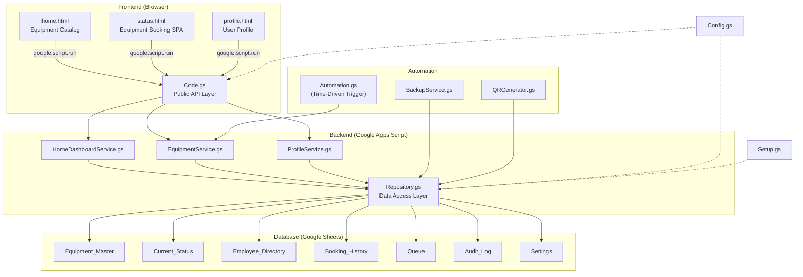
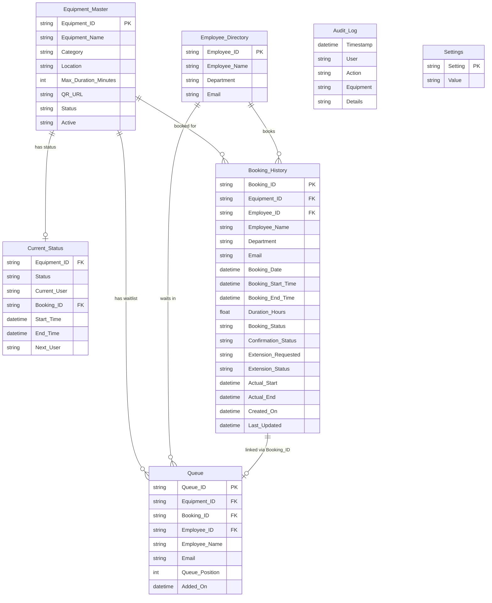
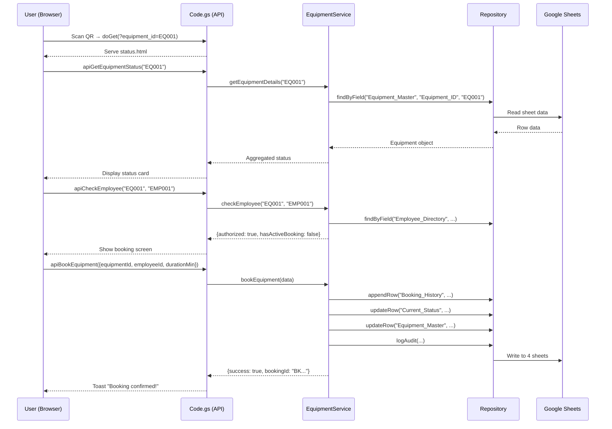

# 🔬 Deep Analysis: Research Equipment Management System (REMS)

> **20 files · ~4,500 lines · Google Apps Script + HTML/CSS/JS · Google Sheets as database**

---

## 1. What Is This Project?

**REMS** is a **Research Equipment Management System** — a full-stack web application built entirely on **Google Workspace** infrastructure. It solves a real-world problem in R&D laboratories:

> *"Who is using this machine right now, and when will they be done?"*

It allows lab researchers to:
- **Scan a QR code** on a physical machine → instantly see its status
- **Book equipment** with time durations (30min – 2 days)
- **Join a waitlist** if equipment is busy
- **Extend** their session or **release** equipment early
- **View their personal profile** with active bookings & history

The entire system runs as a **Google Apps Script Web App** with **Google Sheets as the database** — meaning **zero hosting cost**, and lab managers can edit data directly in a spreadsheet.

---

## 2. Technology Stack

| Layer | Technology | Details |
|-------|-----------|---------|
| **Backend** | Google Apps Script (`.gs`) | Server-side JavaScript, runs on Google's servers |
| **Database** | Google Sheets | 7 sheets/tables, CRUD via `SpreadsheetApp` |
| **Frontend** | HTML5 / CSS3 / Vanilla JS | Served via `HtmlService`, no frameworks |
| **Styling** | Custom CSS (Glassmorphism) | Dark-mode with animated blobs, skeleton loaders |
| **QR Codes** | [QuickChart.io](https://quickchart.io) API | External API for QR generation |
| **QR Scanning** | [html5-qrcode](https://unpkg.com/html5-qrcode) | Camera-based QR scanning in-browser |
| **Fonts** | Google Fonts (Inter) | Modern sans-serif typography |
| **Email** | `MailApp` (Google Apps Script) | Notification emails for queue promotions |
| **Storage** | Google Drive | Backups & QR label sheets stored in Drive folders |
| **Auth** | `localStorage` + Employee Directory sheet | Lightweight client-side session persistence |

---

## 3. Architecture Overview



---

## 4. File-by-File Deep Analysis

### 4.1 Backend — Core Architecture

---

#### [Config.gs](file:///d:/REMS/Config.gs) (26 lines)
**Role:** Central configuration constants.

| Constant | Purpose |
|----------|---------|
| `SPREADSHEET_ID` | The Google Sheets database ID |
| `SHEETS.*` | Names of all 7 sheet tabs (`Equipment_Master`, `Current_Status`, `Booking_History`, `Queue`, `Employee_Directory`, `Settings`, `Audit_Log`) |
| `WEB_APP_URL` | The deployed Google Apps Script web app URL |
| `DRIVE_FOLDERS.QR_CODES` | Google Drive folder ID for QR code storage |
| `DRIVE_FOLDERS.BACKUP` | Google Drive folder ID for database backups |

> [!NOTE]
> Single point of configuration — if any sheet name or URL changes, only this file needs updating.

---

#### [Code.gs](file:///d:/REMS/Code.gs) (305 lines)
**Role:** Main entry point + public API facade.

**Key functions:**

| Function | Lines | Purpose |
|----------|-------|---------|
| `doGet(e)` | 13–53 | HTTP routing — serves `home.html`, `status.html`, or `profile.html` based on URL params |
| `include(filename)` | 60–63 | Template helper to inline CSS/JS partials |
| `apiGetEquipmentStatus()` | 72–80 | Delegates to `EquipmentService.getEquipmentDetails()` |
| `apiGetUserProfile()` | 87–95 | Delegates to `ProfileService.getUserProfile()` |
| `apiGetAllEquipmentStatus()` | 101–104 | Delegates to `HomeDashboardService` |
| `apiBookEquipment()` | 111–119 | Delegates to `EquipmentService.bookEquipment()` |
| `apiJoinQueue()` | 126–134 | Delegates to `EquipmentService.joinQueue()` |
| `apiReleaseEquipment()` | 141–149 | Delegates to `EquipmentService.releaseEquipment()` |
| `apiExtendBooking()` | 156–164 | Delegates to `EquipmentService.extendEquipment()` |
| `apiCheckEmployee()` | 172–180 | Delegates to `EquipmentService.checkEmployee()` |
| `apiWithdrawQueue()` | 187–195 | Delegates to `EquipmentService.withdrawQueue()` |
| `onEdit(e)` | 207–304 | **Spreadsheet trigger** — (1) logs manual edits to `Audit_Log`, (2) auto-syncs new Equipment_Master rows to Current_Status |

> [!IMPORTANT]
> The comments in this file are written in **Hinglish** (Hindi + English), indicating the developer is likely Indian. This is consistent across the entire backend.

---

#### [Repository.gs](file:///d:/REMS/Repository.gs) (190 lines)
**Role:** Data Access Layer (DAL) — abstracts all Google Sheets API interactions.

**Design pattern:** Object literal with in-memory caching.

| Method | Purpose |
|--------|---------|
| `getSpreadsheet()` | Returns cached spreadsheet object |
| `getSheet(name)` | Returns a specific sheet by name |
| `getObjects(sheetName)` | Reads entire sheet → converts rows to JS objects using headers as keys. **Cached per execution.** |
| `findByField(sheet, field, value)` | Finds first row matching `field === value` (string comparison) |
| `appendRow(sheet, obj)` | Appends a new row, mapping object keys to column headers |
| `updateRow(sheet, rowIndex, obj)` | Updates an existing row by index, **preserving formulas** (important for QR codes) |
| `clearCache(sheetName?)` | Invalidates cache after direct sheet mutations (`deleteRow`) |
| `logAudit(actor, action, details, ...)` | Convenience method to write to `Audit_Log` |

> [!TIP]
> The `_rowIndex` property (1-based spreadsheet row number) is automatically attached to every parsed object, enabling direct `updateRow` calls without re-searching.

---

### 4.2 Backend — Business Logic Services

---

#### [EquipmentService.gs](file:///d:/REMS/EquipmentService.gs) (505 lines)
**Role:** The **core engine** — contains all booking business logic. This is the largest and most complex file.

| Method | Lines | Purpose |
|--------|-------|---------|
| `getEquipmentDetails(id)` | 15–49 | Aggregates data from `Equipment_Master`, `Current_Status`, and `Queue` for a single equipment |
| `formatTime(dateStr)` | 51–58 | Converts dates to `HH:MM` format |
| `checkEmployee(eqId, empId)` | 67–100 | Validates employee against `Employee_Directory`, checks if they have an active booking or queue position |
| `bookEquipment(data)` | 108–179 | Creates a new booking: writes to `Booking_History`, updates `Current_Status` and `Equipment_Master`, logs audit |
| `joinQueue(data)` | 187–249 | Adds employee to waitlist: writes to `Queue` and `Booking_History` (status='Waiting'), updates `Next_User` |
| `processBookingCompletion(statusObj)` | 257–381 | **Critical internal method** — marks booking as 'Completed', auto-promotes next person from queue, sends email notification, recalculates queue positions |
| `releaseEquipment(data)` | 389–409 | Early release — validates ownership, delegates to `processBookingCompletion` |
| `extendEquipment(data)` | 417–446 | Extends booking end time, updates both `Booking_History` and `Current_Status` |
| `withdrawQueue(data)` | 455–503 | Removes employee from queue, deletes their 'Waiting' booking, recalculates queue positions |

> [!IMPORTANT]
> `processBookingCompletion()` is the most critical function. It handles:
> 1. Marking the current booking as `Completed`
> 2. Popping the first person from the `Queue` sheet (using `deleteRow` + `clearCache`)
> 3. Creating/updating their booking record to `Using`
> 4. Recalculating queue positions for everyone remaining
> 5. Sending an email notification via `MailApp`
> 6. Updating `Equipment_Master.Status`

---

#### [HomeDashboardService.gs](file:///d:/REMS/HomeDashboardService.gs) (40 lines)
**Role:** Lightweight service for the home catalog page.

- Reads all equipment from `Equipment_Master`
- Joins with `Current_Status` to get real-time availability
- Returns a flat array of `{equipmentId, equipmentName, category, location, currentStatus}`

---

#### [ProfileService.gs](file:///d:/REMS/ProfileService.gs) (112 lines)
**Role:** User profile data assembly.

Key features:
- Fetches employee info from `Employee_Directory`
- Retrieves all bookings from `Booking_History` for that employee
- **Self-healing logic** (lines 57–63): Detects "ghost" bookings — if a booking says `Using` but no matching `Current_Status` exists, it auto-corrects to `Completed` for the UI
- Categorizes bookings into `activeBookings` (Using/Waiting) and `history` (Completed/Withdrawn)

---

### 4.3 Backend — Automation & Utilities

---

#### [Automation.gs](file:///d:/REMS/Automation.gs) (31 lines)
**Role:** Cron job for auto-expiring bookings.

- `runQueueAndExpiryAutomation()`: Iterates all `Current_Status` rows where `Status` is `Using`/`Reserved`
- If `now > End_Time`, calls `EquipmentService.processBookingCompletion()`
- Designed to run via a **Google Apps Script time-driven trigger** (e.g., every 1 minute)

---

#### [BackupService.gs](file:///d:/REMS/BackupService.gs) (43 lines)
**Role:** Database backup utility.

- `runDatabaseBackup()`: Creates a timestamped copy of the entire spreadsheet in the configured Drive backup folder
- Logs the backup event in `Audit_Log`
- Can be triggered manually from the spreadsheet menu or via a nightly cron

---

#### [QRGenerator.gs](file:///d:/REMS/QRGenerator.gs) (128 lines)
**Role:** Generates printable QR code labels.

- Iterates `Equipment_Master`, generates QR codes using `quickchart.io` API
- Creates/updates a "Master QR Labels" spreadsheet in the QR Drive folder with columns: `Sr. No.`, `Equipment ID`, `Equipment Name`, `QR Scanner Code`
- Uses `=IMAGE(url)` formulas — QR codes render as inline images in Google Sheets
- `onOpen()` function creates a custom menu: **REMS Menu** → Setup Database / Generate QR Codes / Run Manual Backup

---

#### [Setup.gs](file:///d:/REMS/Setup.gs) (60 lines)
**Role:** One-time database bootstrapper.

- `setupDatabase()`: Creates all 7 sheets with their header schemas if they don't exist
- Sets headers to **bold** and freezes the first row
- Idempotent — safe to run multiple times

---

### 4.4 Frontend — Home Dashboard

---

#### [home.html](file:///d:/REMS/home.html) (100 lines)
**Role:** HTML structure for the equipment catalog.

Key elements:
- Animated gradient blobs (background decoration)
- Sticky glass-morphism header with search bar
- Loading spinner
- Equipment grid container (dynamically populated)
- Floating "Scan QR" FAB button (PhonePe-style)
- QR Scanner modal (uses `html5-qrcode` library)

---

#### [home_css.html](file:///d:/REMS/home_css.html) (273 lines)
**Role:** CSS for the home dashboard.

Design system:
- **Dark mode** with CSS variables (`--bg: #0f172a`)
- **Glassmorphism** with `backdrop-filter: blur(16px)`
- **Animated gradient blobs** (3 floating colored circles)
- Responsive grid: `grid-template-columns: repeat(auto-fill, minmax(280px, 1fr))`
- Equipment cards with hover lift effects
- Color-coded status badges: green (Available), red (In Use), amber (Maintenance)

---

#### [home_javascript.html](file:///d:/REMS/home_javascript.html) (203 lines)
**Role:** Client logic for the catalog.

| Function | Purpose |
|----------|---------|
| `loadEquipment()` | Calls `apiGetAllEquipmentStatus()` via `google.script.run` |
| `renderGrid(filterText)` | Dynamically builds card HTML for each equipment, filtered by search |
| `openScanner()` | Initializes `Html5Qrcode` camera scanner |
| `closeScanner()` | Stops camera feed |
| `onScanSuccess(text)` | Parses QR code URL → extracts `equipment_id` → redirects to status page |

---

### 4.5 Frontend — Equipment Status SPA

---

#### [status.html](file:///d:/REMS/status.html) (426 lines)
**Role:** Single Page Application for individual equipment management.

Contains **5 screens** (hidden/shown via JS):

| Screen | ID | Purpose |
|--------|----|---------|
| Skeleton | `screen-skeleton` | Shimmer loading state on first load |
| Landing | `screen-landing` | Equipment status card + Employee ID check-in form |
| Book | `screen-book` | Duration selection + "Confirm Booking" or "Join Queue" |
| Manage | `screen-manage` | Active session — "Free Equipment" + "Request Extension" |
| Withdraw | `screen-withdraw` | Queue position display + "Withdraw from Queue" |

Also includes:
- Full-screen loading overlay with orbital spinner animation
- Toast notification system
- Profile icon in header (appears after login)

---

#### [css.html](file:///d:/REMS/css.html) (628 lines)
**Role:** The largest CSS file — extensive design system for the booking SPA.

Highlights:
- **65+ CSS custom properties** (design tokens) for colors, spacing, shadows
- **Skeleton/shimmer animation** system for loading states
- **Orbital double-ring spinner** (inner ring rotates reverse)
- **Duration pills** with selection animation
- **Warning banners** for "currently in use" messages
- **Queue position display** with large numbers
- **Success confirmation animation** with scale pop-in
- **Responsive breakpoints** at 600px and 900px

---

#### [javascript.html](file:///d:/REMS/javascript.html) (465 lines)
**Role:** The most complex frontend file — the booking SPA engine.

Key systems:
1. **State Management**: `equipmentData`, `currentEmpId` (from `localStorage`), `selectedDurMin`
2. **Progress Bar**: Indeterminate header shimmer
3. **Skeleton System**: Fades out after data loads
4. **Action Overlay**: Context-aware loading messages with 30-second safety timeout
5. **Screen Manager**: `showScreen()` handles all SPA transitions with CSS re-animation
6. **Parallel Fetch Pattern** (lines 397–424): After any action, fires a status reload *in parallel* with a minimum toast display time, then navigates when both complete

> [!TIP]
> **Bug fixes documented in code:**
> - **BUG FIX 1** (line 72): Prevents hide-timer race condition in overlay
> - **BUG FIX 2** (line 79): 30-second GAS timeout safety net for hung calls

---

### 4.6 Frontend — User Profile

---

#### [profile.html](file:///d:/REMS/profile.html) (363 lines)
**Role:** HTML + CSS for user profile page.

Features:
- Login overlay (if no `localStorage` token)
- Gradient avatar badge
- Sign Out button
- Tabbed interface: **Active Bookings** / **History**
- Dark-mode glassmorphism aesthetic (consistent with home)
- "Go Back" button context-aware: returns to equipment page if `fromId` param exists

---

#### [profile_javascript.html](file:///d:/REMS/profile_javascript.html) (195 lines)
**Role:** Profile page client logic.

| Function | Purpose |
|----------|---------|
| `submitLogin()` | Manual employee ID entry, saves to `localStorage` |
| `logoutUser()` | Clears `localStorage`, redirects to home |
| `loadProfile(empId)` | Fetches profile via `apiGetUserProfile()` |
| `renderActiveBookings()` | Builds clickable cards linking to equipment status pages |
| `renderHistoryBookings()` | Builds read-only history cards with muted styling |
| `switchTab(tabName)` | Toggles Active/History tab visibility |

---

### 4.7 Documentation

#### [DOCUMENTATION.md](file:///d:/REMS/DOCUMENTATION.md) (98 lines)
Technical architecture reference — lists all 18 files, the 3-layer backend, 3 frontend pages, and 7 database sheets.

#### [Product Walkthrough.md](file:///d:/REMS/Product%20Walkthrough.md) (170 lines)
Non-technical stakeholder document — describes two user journeys (QR scan vs. Dashboard), core capabilities, and the database architecture in plain English.

---

## 5. Database Schema



---

## 6. Data Flow: Complete Booking Lifecycle



---

## 7. 🐛 Bugs Found

### Bug 1: `switchTab()` uses undefined variable `tabId`

**File:** [profile_javascript.html](file:///d:/REMS/profile_javascript.html#L191)
**Line:** 191
**Severity:** 🔴 **Critical** — The History tab is completely broken.

```javascript
// Line 191 — BUG: `tabId` is not defined. Should be `tabName`.
document.getElementById('list-' + tabId).classList.add('active');
```

The function parameter is `tabName` but line 191 references `tabId`, which is `undefined`. Clicking the "History" tab will throw a `ReferenceError` and the tab content will never switch.

**Fix:** Change `tabId` → `tabName`.

---

### Bug 2: Status badge mapping inconsistency

**File:** [home_javascript.html](file:///d:/REMS/home_javascript.html#L71-L73)

The home dashboard checks for `eq.currentStatus === 'In Use'` but the backend returns `'Using'` (from the spreadsheet). This means equipment currently in use will show an **incorrect green "Available" badge** on the home page instead of a red badge.

**Backend returns:** `Using` | `Available` | `Maintenance`
**Frontend checks:** `In Use` | `Available` | `Maintenance`

---

### Bug 3: No XSS sanitization on user-generated content

Several `renderGrid()` and `renderActiveBookings()` functions inject data directly into HTML via string concatenation without escaping. Equipment names or employee names containing HTML characters could cause rendering issues or XSS.

---

## 8. Strengths of this Codebase

| Strength | Details |
|----------|---------|
| ✅ **Clean architecture** | 3-layer separation: API → Service → Repository |
| ✅ **Well-documented** | Every file, function, and module has JSDoc + file-level comments |
| ✅ **Caching** | Repository caches parsed objects per execution cycle |
| ✅ **Self-healing** | Profile service auto-corrects ghost bookings |
| ✅ **Safety nets** | 30-second overlay timeout, parallel fetch pattern |
| ✅ **Queue system** | Full FIFO waitlist with auto-promotion + email notification |
| ✅ **Audit trail** | Every action logged with timestamp, actor, and details |
| ✅ **Zero-cost hosting** | Entirely on Google Workspace — no servers, no cloud bills |
| ✅ **Premium UI** | Glassmorphism, skeleton loaders, micro-animations, responsive |
| ✅ **QR workflow** | End-to-end: generate QR → print → scan → book |

---

## 9. Summary Statistics

| Metric | Count |
|--------|-------|
| Total files | **20** |
| Backend files (`.gs`) | **9** |
| Frontend files (`.html`) | **9** |
| Documentation files (`.md`) | **2** |
| Total lines of code | **~4,500** |
| Backend API endpoints | **9** |
| Database tables (sheets) | **7** |
| Frontend pages | **3** (Home, Status, Profile) |
| SPA screens in status.html | **5** |
| CSS custom properties | **65+** |
| Animations defined | **8** (float, spin, shimmer, dot-pulse, dot-bounce, screen-enter, confirm-pop, toast-in, progress-slide) |
